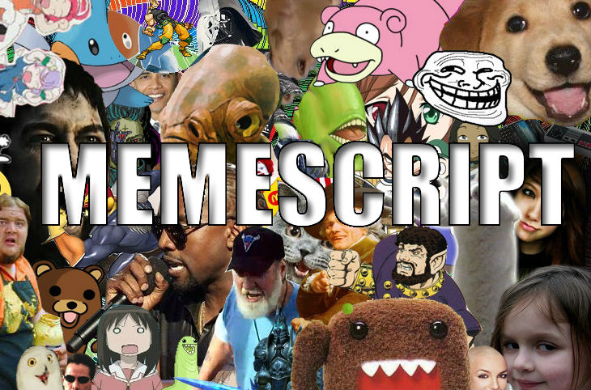

# MEMESCRIPT



## Introduction
---
MemeScript is a language composed entirely of Internet memes. It compiles to JavaScript. Coding in this language will increase your intelligence level by 5 points. Your ability to express yourself will reach hitherto unknown heights, the meaning and subtext of all words will become mashed into the implications of large images with text pasted on top. This language destroys all sorrows.

## Features
---
MemeScript is an object-oriented language that features many memes.

### Functions
Function definitions specify the exact number of parameters that the function call will require. Parameters are passed by value of reference, and can be modified. Parameter evaluation is arbitrary. Functions can return a single value, or no value. Functions can be first-class or recursive, but cannot by anonymous.

### Types
Type checking is done dynamically, and variables are weakly typed. There are only two number types: int and double. There is no character type, as characters are considered strings of length one. Expressions and functions are typeless by default. Types are not objects. There will be supertypes and subtypes, but multiple inheritance is not allowed. Classes are considered to be the same as types, and new types and classes can be added. There are no pointer, parameterized, or dependent types.

### Expressions
Expressions are evaluated eagerly, and only infix notation is allowed. Operators cannot be overloaded, and the precedence of operators is fixed and cannot be changed. Variables can be marked as mutable or immutable, and can be reassigned after initial assignment if they are mutable. Destructuring and pattern matching will be allowed. Scoping is considered to be the same as in JavaScript.

## Examples
---

### Function Declarations
```
you: add(x, y):                                     function add(x, y) {
    me, an intellectual:                                return x + y;
        can i haz x + y;                            }
        
you: add(x = 10, y = 10):                           function add(x = 10, y = 10) {
    me, an intellectual:                                return x + y;
        can i haz x + y;                            }
        
you: add(x, y...):                                  function add(x, y...) {                         
    me, an intellectual:                                alert(y);
        here come dat boi (y);                          console.log("For Harambe");
        dicks.out("For Harambe");                   }
```

### If Statement
```
I don't always (homework.isFinished()):             if (homework.isFinished()) {
    but when I do:                                      me.goToSleep();
        me.goToSleep();                             }
```

### If-ElseIf-Else Statement
```
I don't always (homework.isFinished()):             if (homework.iseFinished() {
    but when I do:                                      me.goToSleep();
        me.goToSleep();                             } else if (homework.procrastinating()) {
    but sometimes I (homework.procrastinating()):       me.procrastinate();
        me.procrastinate();                         } else {
    otherwise I do:                                     me.readBook();
        me.readBook();                              }
```

### Switch Statement
```
this is bill(x):                                    switch (x) {
    bill has a "banana":                                case "banana":
        me.eat(x);                                          me.eat(x);
        be like bill;                                       break;
    bill is a "cheeseburger":                           case "cheeseburger":
        me.eat(x);                                          me.eat(x);
        be like bill;                                       break;
    bill is smart:                                      default:
        me.buyFood();                                       me.buyFood();
        be like bill;                                       break;
                                                    }
```

### While Loop
```
yo, I'mma let you finish (weather.isRaining()):     while (weather.isRaining()) {
    but:                                                me.stayInside();
        me.stayInside();                            }
```

### Variable Declaration
```
ermahgerd book = 0;                                     let book = 0;
overlyattachedgirlfriend.jpg book = 0;                  const book = 0;
```

### Try, Catch, and Finally
```
Chuck Norris doesn't:                               try {
    console.doge("testing testing");                    console.doge("testing testing");
he (err):                                           } catch (err) {
    console.error(err);                                 console.error(err);
otherwise he:                                       } finally {
    console.log("testing testing");                     console.log("testing testing");
                                                    }

Chuck Norris doesn't:                               try {
    such me;                                            var me = null;
    me = null;                                          me.wakeUp();  
    me.wakeUp();                                    } catch (err) {
he (err):                                               console.error(err);
    console.error(err);                             }
```

### For Loop
```
one does not simply:                                for (var i = 0; i < 10; i++) {
    me.doHomework();                                    me.doHomework();
    me.manageTimeProperly();                            me.manageTimeProperly();
    me.goToSleep();                                     me.goToSleep();
without (such i; i < 10; i++)                       }
```
### Arrays
```
spliced
indexed
foreach
length
concat
sort
map
filter
pop
push
remove
insert
```

### String
```
substring
charat
length
indexof
concat
```

### Objects
```
this is Stack:
    much asddasda
constructor (doge)
methods
```
